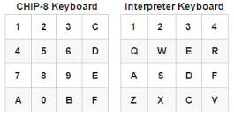
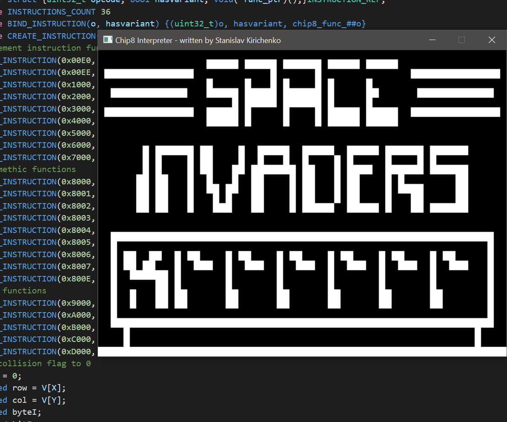
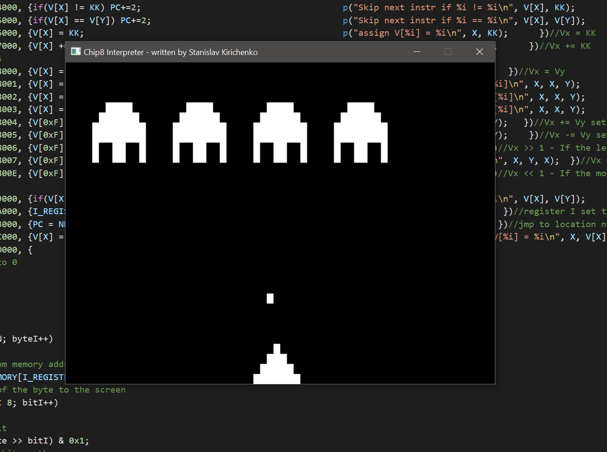

# Chip8-ANSI-C-Interpreter

`This project is not meant to be an accurate emulation of the CHIP8 architecture, it is just for academic/learning purpose.`

Fun project written in ANSI C in 2 days (written many years ago). It runs different roms, some will not run and I didn't bother fixing it.
The code uses some MACRO programming to define the functions to run the OP codes.
Implemented in ANSI C for maximum portability.
Should works seamlessly on various platforms, currently tested only on Windows.
Supports loading and running CHIP-8 programs by dragging the rom onto the executable or passing it through cli.
Emulates CHIP-8's simple sound system, producing tones (not sure how accurate they are).

# Builds
Available in the `x64` and `x86` folders there are the executable, that should run fine on windows.

The bindings are:

# Dependencies
Dependencies: [SDL2](https://github.com/libsdl-org/SDL.git) for window/input/sound/graphics

# Visual proof
This is "Space Invaders" by David Winter running on the interpreter.

